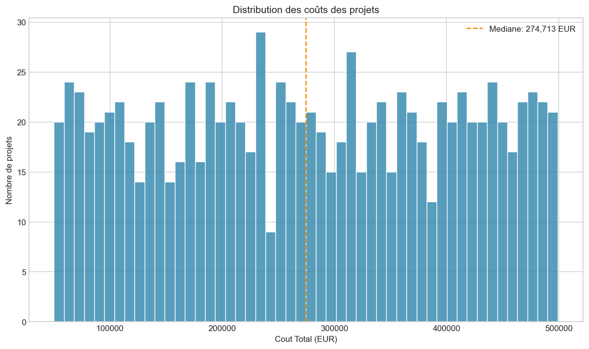
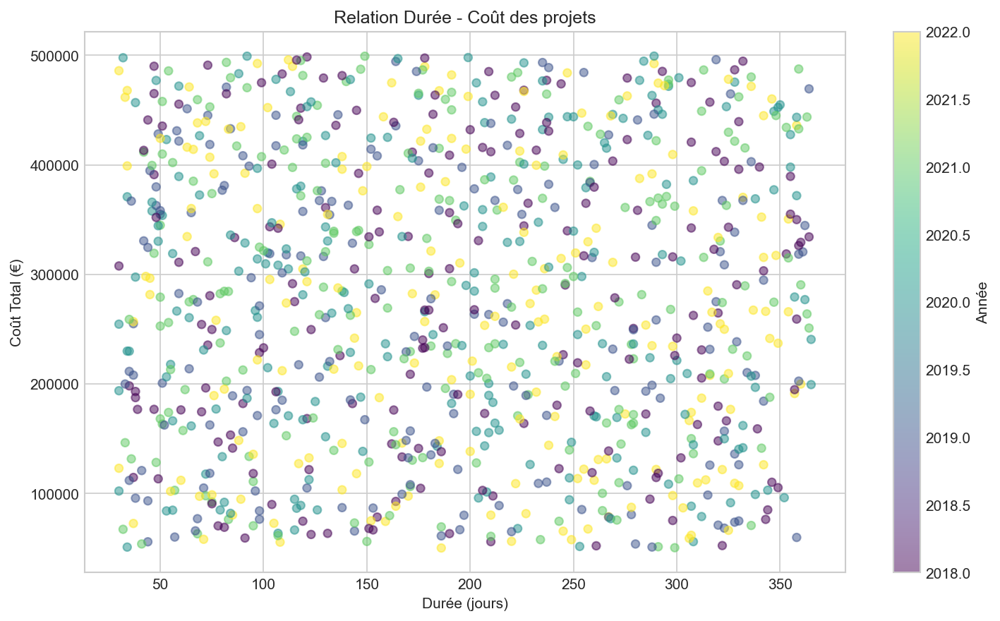
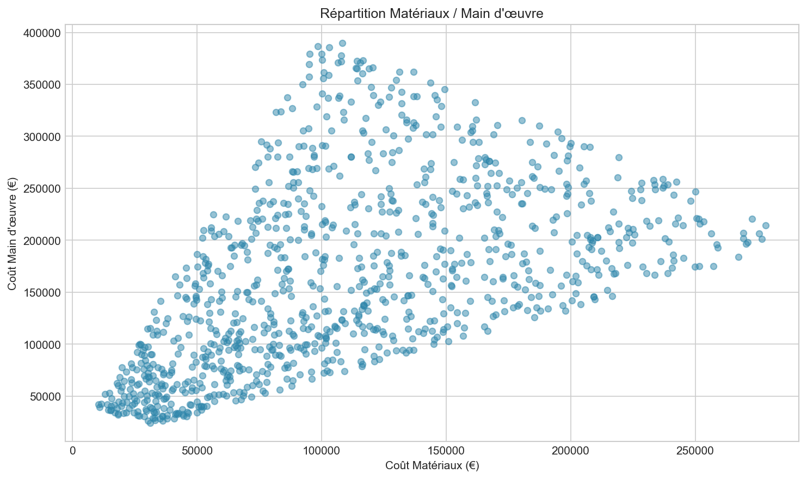
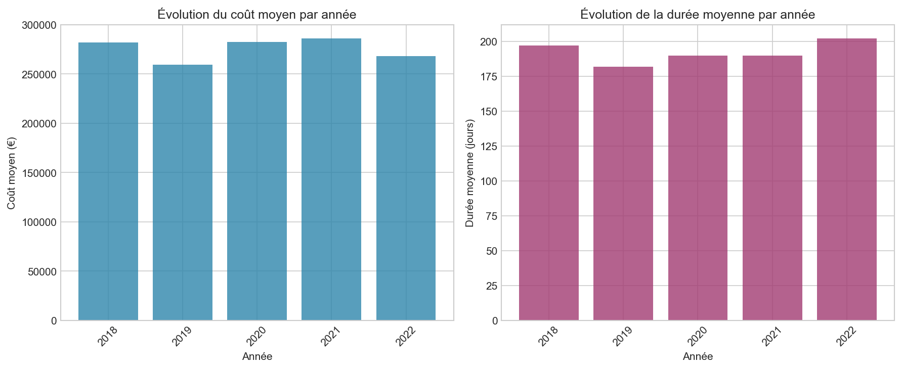
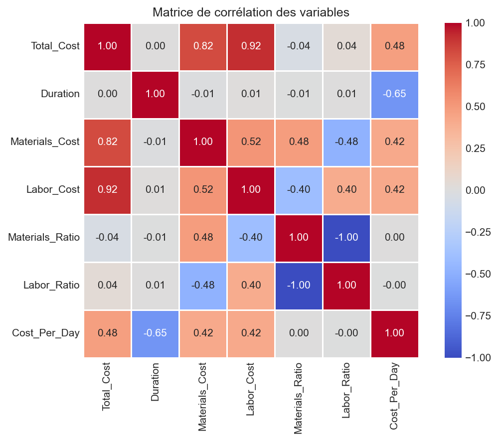
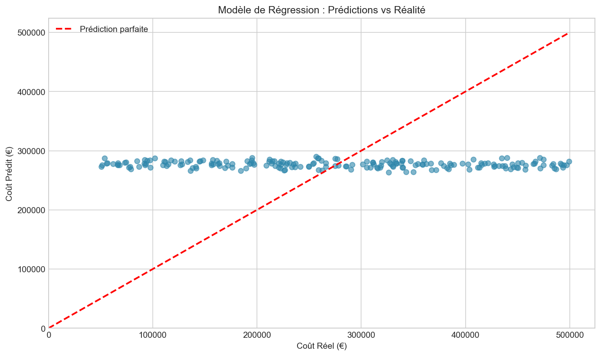
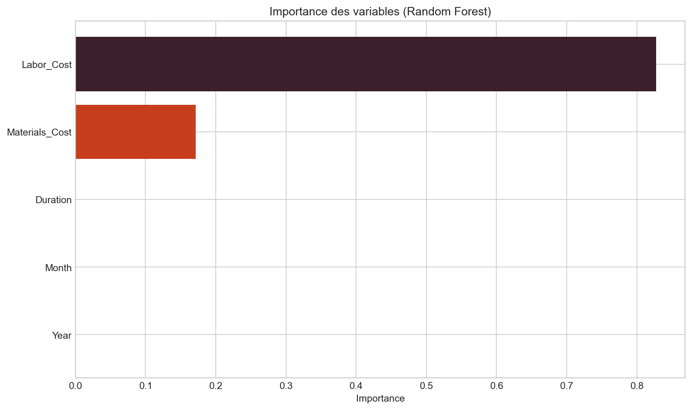

# Rapport d'analyse - Optimisation des coûts et de la durée des chantiers

**Projet :** Analyse des données historiques de construction  
**Date :** Février 2025  
**Contexte :** Data Manager (3 ans d’expérience) en transition vers Data Engineer

---

## A. Description du projet

Analyse des données historiques de projets de construction pour :
- Identifier des tendances sur les coûts et les durées
- Construire un modèle prédictif pour anticiper les coûts futurs
- Évaluer les économies potentielles

---

## B. Objectifs atteints

### 1. Collecte des données
- **Source :** 1 000 projets de construction (2018–2023)
- **Variables :** temps (durée, dates), coûts (total, matériaux, main d’œuvre, budget), ressources

### 2. Nettoyage et transformation
- Suppression des doublons et valeurs manquantes
- Création de variables calculées : coût/jour, ratios matériaux/labor, année, mois

### 3. Modèle de régression
- Régression linéaire (variables : durée, année, mois)
- Random Forest pour l’importance des variables
- Prédiction des coûts à partir des caractéristiques du projet

---

## C. Résultats visuels

### Distribution des coûts

- Coûts concentrés entre 100 000 € et 400 000 €
- Médiane utile comme référence pour comparer les projets

### Relation Durée–Coût

- Lien positif entre durée et coût
- Variabilité importante selon les projets

### Matériaux vs main d’œuvre

- Répartition variable entre postes
- Piste d’optimisation : équilibrage des ratios par type de projet

### Évolution annuelle

- Suivi des coûts moyens et durées moyennes par année
- Base pour analyser les tendances et l’effet de l’inflation

### Matrice de corrélation

- Fortes corrélations : Total_Cost ↔ Materials_Cost, Labor_Cost
- Durée corrélée au coût total

### Prédictions du modèle

- Alignement prédictions/réalité le long de la diagonale = bon modèle

### Importance des variables (Random Forest)

- **Materials_Cost** et **Labor_Cost** = principaux leviers du coût total
- **Duration** = facteur secondaire mais pertinent

---

## D. Économies potentielles

| Indicateur | Valeur |
|------------|--------|
| Projets à optimiser | 500 |
| Économie potentielle totale | **77,4 M€** |
| Référence | Projets alignés sur la médiane du coût/jour |

**Pistes d’optimisation :**
- Réduire le coût par jour sur les projets au-dessus de la médiane
- Rationaliser les ratios matériaux/main d’œuvre selon les bonnes pratiques identifiées

---

## E. Technologies utilisées

| Composant | Technologie |
|-----------|-------------|
| Analyse & modélisation | Python, pandas, scikit-learn |
| Données structurées | SQL (création de tables, vues, requêtes analytiques) |
| Visualisation | Matplotlib, Seaborn, Power BI (Excel exporté) |

---

## F. Livrables

1. **Script Python** : `construction_analysis.py` – pipeline de bout en bout
2. **Requêtes SQL** : `sql/` – création et préparation des données
3. **Power BI** : `power_bi/` – instructions et transformations Power Query
4. **Graphiques** : `outputs/` – 7 visualisations
5. **Données pour BI** : `outputs/Construction_Projects_Analytics.xlsx`

---

## G. Recommandations

- Déployer un suivi temps réel des coûts par projet
- Utiliser le modèle prédictif dès la planification
- Créer des dashboards Power BI pour le pilotage
- Prioriser les projets au-dessus de la médiane pour les actions d’optimisation

---

## H. Call to action

> **Vous souhaitez échanger sur ce projet ?**
>  
> Je serais ravi de vous présenter l’approche technique, les choix de modélisation et les pistes d’évolution (automatisation, intégration à une base de données, API, etc.).
>  
> **N’hésitez pas à me contacter pour en discuter.**
